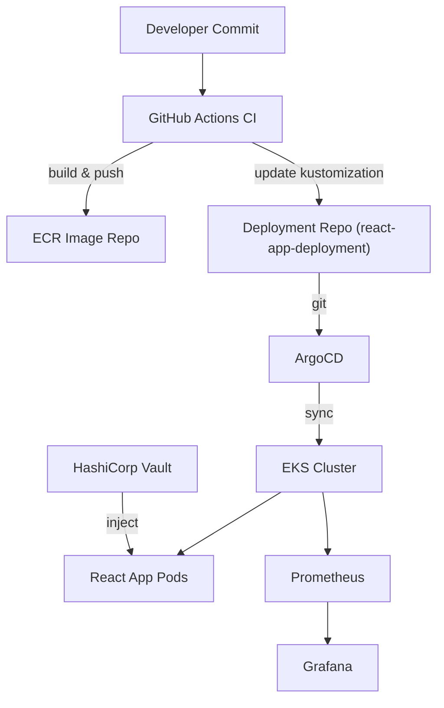
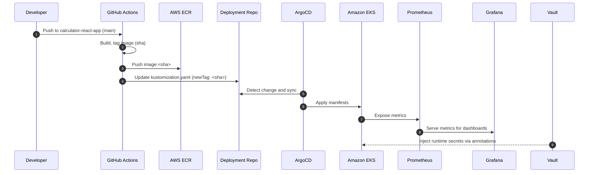
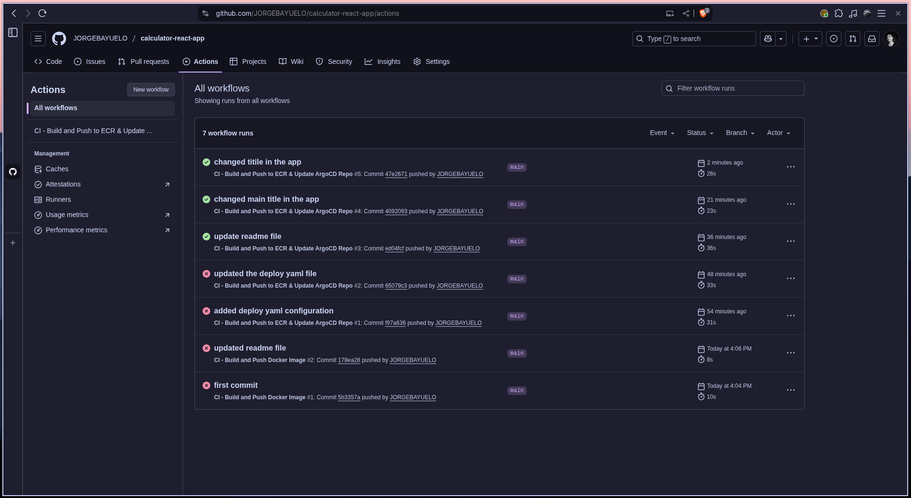

# terraform-aws-devops-pipeline-eks-ecr-helm-vault

**Full end-to-end DevOps pipeline** implemented and demonstrated with: **Terraform → AWS (ECR, EKS) → Helm → ArgoCD → Prometheus & Grafana → HashiCorp Vault.**

It integrates Infrastructure-as-Code (IaC), GitOps, Observability, and Secrets Management, all orchestrated within AWS services.

---

## 1. Purpose & Project Summary

**Purpose.** Demonstrate a production-approach DevOps project where:
- Infrastructure is defined with **Terraform** (reproducible IaC).
- Application images are built and stored in **AWS ECR**.
- Deployments are driven by **GitOps** (ArgoCD) from a dedicated deployment repository.
- Cluster tooling (Prometheus, Grafana, Vault) is deployed via **Helm**.
- **Prometheus + Grafana** provide observability.
- **HashiCorp Vault** provides runtime secrets injection into Kubernetes workloads.

**Why this matters.** This showcases the modern best practices used by many cloud-native teams: separation of concerns (infra / app / deployment repos), immutable images, GitOps-driven continuous delivery, centralized secrets management, and metrics-driven observability.

## 2. Architecture Overview



## CI/CD Sequence Diagram



## 3. What you will learn / Key outcomes

- Authoritative Terraform layout for multi-module infra (VPC, EKS, IAM).
- Integrating ECR into CI to host immutable images.
- GitHub Actions pipeline: build → push → update manifests.
- ArgoCD GitOps: automated deployment & auto-sync.
- Using Helm for Prometheus, Grafana, Vault, and EBS CSI driver.
- Vault Kubernetes auth + agent injector for runtime secrets.
- Clean teardown to avoid cloud costs.

## 4. Repositories used (what and why)

You should use three repositories for a clean separation of duties:

1. `secure-infra-terraform-vault` — **Infrastructure repo (private)**
  - Holds Terraform code and modules. Manages AWS resources: VPC, EKS, IAM, node groups, S3 backend for state.
2. `calculator-react-app` — **Application repo (could be private or public)**
  - React source code, `Dockerfile`, unit tests, and **GitHub Actions** CI pipeline that builds and pushes images to ECR and updates the deployment repo.
3. `react-app-deployment` — **Deployment (GitOps) repo (private recommended)**
  - Holds Kubernetes manifests: `deployment.yaml`, `service.yaml`, `kustomization.yaml`. ArgoCD watches this repo and syncs to EKS.

## 5. Prerequisites

- AWS account with permission to create: VPC, EKS, EC2, IAM roles, ECR, ELB, EBS volumes.
- Local tools installed:
  - `terraform` >= 1.11.0
  - `aws` CLI
  - `helm` (v3)
  - `eksctl` (recommended for IAM service account shortcuts)
  - Docker (to build images)
- GitHub account with:
  - Repos for `calculator-react-app` and `react-app-deployment`
  - A Personal Access Token (PAT) with limited repo write permissions for the deployment repo (used by CI to push kustomization changes).
- Basic familiarity with Kubernetes manifests, Helm, and Terraform modules.

## 6. Folder & module layout

**Terraform repo layout**

```lua
secure-infra-terraform-vault/
├── backend.tf
├── main.tf
├── provider.tf
├── variables.tf
├── modules/
│   ├── vpc/
│   │   ├── main.tf
│   │   ├── variables.tf
│   │   └── outputs.tf
│   ├── eks/
│   │   ├── main.tf
│   │   ├── variables.tf
│   │   └── outputs.tf
│   └── vault/
│       ├── main.tf
│       ├── variables.tf
│       └── outputs.tf
└── environments/
    ├── dev/
        ├── main.tf
        ├── backend.tf
        ├── provider.tf
        ├── variables.tf
        └── terraform.tfvars
    
```

**Calculator app repo layout**

```lua
calculator-react-app/
├── src/
├── public/
├── Dockerfile
├── package.json
└── .github/workflows/deploy.yml
```

**Deployment manifests repo**

```lua
react-app-deployment/
├── deployment.yaml
├── service.yaml
└── kustomization.yaml
```

## 7. Terraform files, structure, and step by step instructions

This section includes safe, sanitized examples of the most important Terraform configurations used during the project. The examples below intentionally avoid credentials and account IDs,  use variables and secrets in your own environment.

### 7.1 Root provider configuration (`providers.tf`)

Place this at the root of your Terraform repo to centralize provider configuration:

```hcl
terraform {
  required_version = ">= 1.11.0"
  required_providers {
    aws = {
      source  = "hashicorp/aws"
      version = "~> 5.95"
    }
    kubernetes = {
      source  = "hashicorp/kubernetes"
      version = "~> 2.38"
    }
    helm = {
      source  = "hashicorp/helm"
      version = "~> 2.17"
    }
  }
}

provider "aws" {
  region = var.aws_region
}
```

**Why centralized?** This avoids provider version mismatches and ensures modules do not declare conflicting provider constraints.

### 7.2 Backend (S3) `backend.tf` — Terraform remote state

Using Terraform >= 1.11, S3 native locking is available.

```hcl
terraform {
  backend "s3" {
    bucket = var.tfstate_bucket
    key    = "secure-infra/terraform.tfstate"
    region = var.aws_region
    encrypt = true
  }
}
```

### 7.3 Environment wrapper: `environments/dev/main.tf`

This file composes modules and sets environment-specific variables:

```hcl

module "vpc" {
  source = "../../modules/vpc"
  project_name = var.project_name
  environment = "dev"
  vpc_cidr = "10.0.0.0/16"
  public_subnets = ["10.0.101.0/24","10.0.102.0/24"]
  private_subnets = ["10.0.11.0/24","10.0.12.0/24"]
}
 
module "eks" {
  source = "../../modules/eks"
  vpc_id = module.vpc.vpc_id
  private_subnets = module.vpc.private_subnets
  cluster_name = "secure-eks-dev"
  cluster_version = "1.33"
  node_group_instance_types = ["t3.medium"]
}
```

### 7.4 Example module: `modules/vpc/main.tf` (use official module)

```hcl
data "aws_availability_zones" "available" {
  state = "available"
}

module "vpc" {
  source  = "terraform-aws-modules/vpc/aws"
  version = ">= 6.0.0"
  name = "${var.project_name}-${var.environment}"
  cidr = var.vpc_cidr
  azs  = slice(data.aws_availability_zones.available.names, 0, 2)
  public_subnets  = var.public_subnets
  private_subnets = var.private_subnets
  enable_nat_gateway = true
  single_nat_gateway = true

  tags = {
    Project     = var.project_name
    Environment = var.environment
  }
}
```

### 7.5 Example module: `modules/eks/main.tf` (use official module)

Use `terraform-aws-modules/eks/aws` to manage cluster and node groups.

```hcl
module "eks" {
  source  = "terraform-aws-modules/eks/aws"
  version = "~> 20.0"

  cluster_name    = var.cluster_name
  cluster_version = var.cluster_version
  vpc_id          = var.vpc_id
  subnet_ids      = var.subnet_ids

  eks_managed_node_groups = {
    default = {
      desired_size = 2
      max_size     = 3
      min_size     = 1
      instance_types = ["t3.medium"]
      disk_size = 20
      ami_type  = "AL2_x86_64"
    }
  }

  tags = {
    Environment = var.environment
    Project     = var.project_name
  }
}
```

### 7.6 Typical workflow (apply infra)

  1. `terraform init` (in `environments/dev/`) — initializes providers & modules.
  2. `terraform plan -out=tfplan` — validates plan.
  3. `terraform apply tfplan` or `terraform apply -auto-approve` — create resources.

**Important notes:**

- If provider constraints conflict between modules and root, consolidate them in the root `providers.tf`.
- If `terraform init` requires `-upgrade` after changing module/provider versions, use it carefully and track `.terraform.lock.hcl`.

## 8. Docker & ECR (build, tag, push)

### 8.1 Dockerfile multi-stage React build

```dockerfile
# Stage 1 - build
FROM node:20-alpine AS build
WORKDIR /app
COPY package*.json ./
RUN npm ci
COPY . .
RUN npm run build

# Stage 2 - serve with nginx
FROM nginx:alpine
RUN rm -rf /usr/share/nginx/html/*
COPY --from=build /app/dist /usr/share/nginx/html
COPY nginx.conf /etc/nginx/conf.d/default.conf
EXPOSE 80
CMD ["nginx","-g","daemon off;"]
```

### 8.2 Local push to ECR (manual steps — CI handles this automatically in production)

1. Create repo:

```bash
aws ecr create-repository --repository-name calculator-app --region us-east-1
```

2. Login to ECR (stores docker credentials in `~/.docker/config.json` — remove if you want after use):

```bash
aws ecr get-login-password --region us-east-1 | docker login --username AWS --password-stdin <ACCOUNT_ID>.dkr.ecr.us-east-1.amazonaws.com
```

3. Build, tag, push:

```bash
docker build -t calculator-app:latest .
docker tag calculator-app:latest <ACCOUNT_ID>.dkr.ecr.us-east-1.amazonaws.com/calculator-app:latest
docker push <ACCOUNT_ID>.dkr.ecr.us-east-1.amazonaws.com/calculator-app:latest
```

**Security note:** The aws ecr get-login-password stores a short-lived token in Docker config. Clear ~/.docker/config.json if you prefer not to retain credentials.

## 9. GitHub Actions CI — workflow & secrets

**Purpose:** Build Docker image, push to ECR, update `react-app-deployment` `kustomization.yaml` with the new image tag (commit SHA). ArgoCD picks up changes and deploys.

**File:** `.github/workflows/deploy.yml` (in `calculator-react-app` repo)

```yaml
name: CI - Build and Push to ECR & Update ArgoCD Repo

on:
  push:
    branches: [ main ]

jobs:
  build-and-deploy:
    runs-on: ubuntu-latest
    steps:
      - name: Checkout source
        uses: actions/checkout@v4

      - name: Configure AWS credentials
        uses: aws-actions/configure-aws-credentials@v4
        with:
          aws-access-key-id: ${{ secrets.AWS_ACCESS_KEY_ID }}
          aws-secret-access-key: ${{ secrets.AWS_SECRET_ACCESS_KEY }}
          aws-region: ${{ secrets.AWS_REGION }}

      - name: Log in to Amazon ECR
        id: login-ecr
        uses: aws-actions/amazon-ecr-login@v2

      - name: Build, tag, and push image
        id: build_image
        env:
          ECR_REGISTRY: ${{ steps.login-ecr.outputs.registry }}
          ECR_REPOSITORY: ${{ secrets.ECR_REPOSITORY }}
        run: |
          IMAGE_TAG=${{ github.sha }}
          docker build -t $ECR_REGISTRY/$ECR_REPOSITORY:$IMAGE_TAG .
          docker push $ECR_REGISTRY/$ECR_REPOSITORY:$IMAGE_TAG
          echo "IMAGE_TAG=$IMAGE_TAG" >> $GITHUB_ENV

      - name: Checkout deployment repo
        uses: actions/checkout@v4
        with:
          repository: ${{ secrets.DEPLOYMENT_REPO }}
          token: ${{ secrets.DEPLOY_TOKEN }}
          path: deployment
          persist-credentials: false

      - name: Update kustomization.yaml in deployment repo
        working-directory: deployment
        run: |
          sed -i "s|newTag:.*|newTag: ${IMAGE_TAG}|" kustomization.yaml || (echo "kustomization.yaml not updated by sed" && exit 1)
          git config user.name "github-actions[bot]"
          git config user.email "github-actions[bot]@users.noreply.github.com"
          git add kustomization.yaml
          git commit -m "Update image tag to ${IMAGE_TAG}" || echo "no changes to commit"
          git push
```

**Required repository secrets (calculator-react-app):**

- `AWS_ACCESS_KEY_ID` — IAM user with permissions to push to ECR (use least privilege).
- `AWS_SECRET_ACCESS_KEY`
- `AWS_REGION` — `us-east-1`
- `ECR_REPOSITORY` — `calculator-app`
- `DEPLOYMENT_REPO` — `owner/react-app-deployment` (string)
- `DEPLOY_TOKEN` — GitHub PAT with write access to `react-app-deployment` (do not name it GITHUB_*; GitHub denies secret names starting with GITHUB_)

**Notes & gotchas:**

- `actions/checkout` requires a `token` when checking out a different repository. Use `persist-credentials: false` so the supplied token is used for pushing changes.
- If the `sed` command returns "nothing to commit", the action will exit non-zero unless you handle it (`|| echo "no changes to commit"` is used to avoid failing builds when the image tag is unchanged).

## 10. Deployment repo + Kubernetes manifests

`react-app-deployment` **repo** contains manifests ArgoCD watches.

`deployment.yaml`

```yaml
apiVersion: apps/v1
kind: Deployment
metadata:
  name: react-app
  labels:
    app: react-app
spec:
  replicas: 2
  selector:
    matchLabels:
      app: react-app
  template:
    metadata:
      labels:
        app: react-app
      annotations:
        # Vault injector annotations (example)
        vault.hashicorp.com/agent-inject: "true"
        vault.hashicorp.com/role: "react-app"
        vault.hashicorp.com/agent-inject-secret-API_KEY: "secret/data/react-app"
        vault.hashicorp.com/agent-inject-template-API_KEY: |
          {{- with secret "secret/data/react-app" -}}
          {{ .Data.data.API_KEY }}
          {{- end }}
    spec:
      serviceAccountName: react-app
      containers:
      - name: react-app
        image: <ACCOUNT_ID>.dkr.ecr.us-east-1.amazonaws.com/calculator-app:latest
        ports:
        - containerPort: 80
```

`service.yaml`

```yaml
apiVersion: v1
kind: Service
metadata:
  name: react-app-service
spec:
  selector:
    app: react-app
  ports:
    - port: 80
      targetPort: 80
  type: LoadBalancer
```

`kustomization.yaml`

```yaml
resources:
  - deployment.yaml
  - service.yaml

images:
  - name: <ACCOUNT_ID>.dkr.ecr.us-east-1.amazonaws.com/calculator-app
    newTag: latest
```

**Why** `kustomization.yaml`?

- The CI updates `newTag` with the commit SHA. ArgoCD watches the repo and auto-syncs the new tag into the cluster. This pattern decouples CI (build & tag) from CD (deployment & rollout).

## 11. ArgoCD — create application & enable Auto-Sync

1. In ArgoCD UI → New Application:
  - **Repository URL:** `https://github.com/<owner>/react-app-deployment.git`
  - **Revision:** `HEAD` or `main`
  - **Path:** `.` (or `k8s/` if you put manifests there). Use `.` for root manifest files.
  - **Destination:** `https://kubernetes.default.svc` and namespace `default`
  - Under **Sync Policy**, enable:
    - **Automated** (Auto-Sync)
    - **Prune resources**
    - **Self Heal**
Notes:
- If the deployment repo is private, configure access in ArgoCD **Settings → Repositories** using HTTPS + PAT or an SSH key.
- `Path` must be relative in the repo — use `.` for root. Using `/` will cause `InvalidSpecError`.

## 12. Helm installs (ArgoCD, Prometheus, Grafana, EBS CSI driver, Vault)

Use `helm repo add` to add required charts first.

**Add helm repos**

```bash
helm repo add argo https://argoproj.github.io/argo-helm
helm repo add prometheus-community https://prometheus-community.github.io/helm-charts
helm repo add grafana https://grafana.github.io/helm-charts
helm repo add hashicorp https://helm.releases.hashicorp.com
helm repo add aws-ebs-csi-driver https://kubernetes-sigs.github.io/aws-ebs-csi-driver
helm repo update
```

**ArgoCD (namespace `aegocd`)**

```bash
kubectl create namespace argocd
helm install argocd argo/argo-cd -n argocd
```

**Prometheus (namespace `monitoring`)**

```bash
kubectl create namespace monitoring
helm install prometheus prometheus-community/prometheus -n monitoring
```

**Common issue:** Prometheus server PVCs stuck in `Pending` if no storage provisioner — install the EBS CSI driver (below).

**Grafana**

```bash
helm install grafana grafana/grafana -n monitoring
# Retrieve password:
kubectl get secret --namespace monitoring grafana -o jsonpath="{.data.admin-password}" | base64 --decode ; echo
# port-forward locally:
kubectl port-forward -n monitoring svc/grafana 3000:80
```

## EBS CSI driver (so PVCs can be dynamically provisioned in EKS)

1. Ensure cluster OIDC provider:

```bash
eksctl utils associate-iam-oidc-provider --region us-east-1 --cluster secure-eks-dev --approve
```

2. Create IAM service account for the driver (eksctl):

```bash
eksctl create iamserviceaccount \
  --region us-east-1 \
  --name ebs-csi-controller-sa \
  --namespace kube-system \
  --cluster secure-eks-dev \
  --attach-policy-arn arn:aws:iam::aws:policy/service-role/AmazonEBSCSIDriverPolicy \
  --approve
```

3. Install driver:

```bash
helm install aws-ebs-csi-driver aws-ebs-csi-driver/aws-ebs-csi-driver -n kube-system \
  --set controller.serviceAccount.create=false \
  --set controller.serviceAccount.name=ebs-csi-controller-sa
```

### Vault (dev mode for demo or adjust for prod)

**Dev mode** is intentionally insecure — do not use dev mode in production.

```bash
kubectl create namespace vault
helm install vault hashicorp/vault -n vault --set "server.dev.enabled=true"
# To enable injector later:
helm upgrade vault hashicorp/vault -n vault --set "injector.enabled=true" --reuse-values
```

After installation, confirm pods are Running. Use `kubectl port-forward` to access UI on `localhost:8200`.

## 13. Prometheus & Grafana — verify and import dashboards

### Prometheus access (local port-forward)

```bash
kubectl port-forward -n monitoring svc/prometheus-server 9090:80
# then open http://localhost:9090
# check: Status → Targets (should show nodes and kube-state metrics as UP)
```

### Grafana access & datasource

1. port-forward:

```bash
kubectl port-forward -n monitoring svc/grafana 3000:80
```

2. Login:
    - **user:** `admin`
    - **password:** from secret: `kubectl get secret --namespace monitoring grafana -o jsonpath="{.data.admin-password}" | base64 --decode`
3. Add Prometheus data source:
    - URL: `http://prometheus-server.monitoring.svc.cluster.local`
4. Import Kubernetes dashboard:
    - Grafana → `+` → Import → dashboard ID `315` (Kubernetes cluster (Prometheus)) or other dashboards like `6417`, `8588`.

## 14. Vault integration — step by step

This section covers enabling Kubernetes auth, creating policies/roles, and using the Vault Agent Injector to inject secrets into pods.

> These steps assume Vault was installed via Helm and the injector is enabled.

### 14.1 Create a test secret

```bash
kubectl exec -n vault -it vault-0 -- vault kv put secret/react-app API_KEY="super-secret-api-key"
kubectl exec -n vault -it vault-0 -- vault kv get secret/react-app
```

### 14.2 Enable Kubernetes auth & configure token reviewer

From inside the Vault pod (or via Vault CLI configured to talk to the service):

```bash
kubectl exec -n vault -it vault-0 -- sh -c '
vault auth enable kubernetes &&
vault write auth/kubernetes/config \
  token_reviewer_jwt="$(cat /var/run/secrets/kubernetes.io/serviceaccount/token)" \
  kubernetes_host="https://$KUBERNETES_PORT_443_TCP_ADDR:443" \
  kubernetes_ca_cert=@/var/run/secrets/kubernetes.io/serviceaccount/ca.crt
'
```

**Why this?** Vault must trust Kubernetes to validate pod identity via the ServiceAccount token.

### 14.3 Create a Vault policy for the app

```bash
cat <<EOF > /tmp/react-policy.hcl
path "secret/data/react-app" {
  capabilities = ["read"]
}
EOF

kubectl cp /tmp/react-policy.hcl vault-0:/tmp/react-policy.hcl -n vault
kubectl exec -n vault -it vault-0 -- vault policy write react-app /tmp/react-policy.hcl
```

### 14.4 Create a role that binds Kubernetes SA to the policy

```bash
kubectl exec -n vault -it vault-0 -- vault write auth/kubernetes/role/react-app \
  bound_service_account_names=react-app \
  bound_service_account_namespaces=default \
  policies=react-app \
  ttl=24h
```

### 14.5 Create the Kubernetes service account (if missing)

`serviceaccount.yaml`:

```bash
apiVersion: v1
kind: ServiceAccount
metadata:
  name: react-app
  namespace: default
```

Apply:

```bash
kubectl apply -f serviceaccount.yaml
```

### 14.6 Annotate your deployment for injector (as in `deployment.yaml` earlier)

Important annotations:

- `vault.hashicorp.com/agent-inject: "true"`
- `vault.hashicorp.com/role: "react-app"`
- `vault.hashicorp.com/agent-inject-secret-<ENVNAME>: "secret/data/react-app"`

When the pod is created, the Vault Agent Injector sidecar authenticates to Vault using the pod’s ServiceAccount token and writes secrets (files/env variables) into /vault/secrets/ (or as configured). Example to verify:

```bash
POD=$(kubectl get pods -l app=react-app -o jsonpath='{.items[0].metadata.name}')
kubectl exec -it $POD -- cat /vault/secrets/API_KEY
# should output: super-secret-api-key
```

**Security note:** For production, use secure Vault server configs (HA mode, TLS, auto-unseal via KMS).

## 15. Troubleshooting: common issues & practical fixes

Below are specific problems you are likely to encounter and how we fixed them during the project:

### Problem: Provider version conflicts during `terraform init`

**Symptom:** `Could not retrieve the list of available versions for provider hashicorp/aws` or conflicting constraints.
**Fix:** Consolidate provider constraints in the root `providers.tf`, remove provider version pins inside modules, run `terraform init -upgrade` and ensure `.terraform.lock.hcl` matches the right selection.

### Problem: Prometheus pods Pending with `pod has unbound immediate PersistentVolumeClaims`

**Cause:** No dynamic storage provisioner; PVCs cannot bind.
**Fix:** Install the AWS EBS CSI driver and create a CSI-backed StorageClass; re-create PVCs or upgrade the Helm chart to point to `gp3-csi`.

### Problem: ArgoCD cannot read private repo

**Symptom:** `repo client error while testing repository: authentication required`
**Fix:** Add the repo under ArgoCD Settings → Repositories using PAT or SSH key. Use the exact repo URL including `.git` and `.` path.

### Problem: `actions/checkout` error `Input required and not supplied: token`

**Cause:** GitHub secret name mismatch or missing token.
**Fix:** Add `DEPLOY_TOKEN` secret and set `persist-credentials: false` in the checkout step; ensure secret name matches exactly.

### Problem: VPC cannot be deleted after Terraform destroy

**Cause:** Remaining Load Balancer, ENIs, or unattached EBS volumes blocking deletion.
**Fix:** Delete ELB/ALB target groups and load balancers first, then delete ENIs or EBS volumes, then delete subnets and VPC.

## 17. Cleanup & cost control (complete teardown)

**Terraform destroy** (primary cleanup)

```bash
cd secure-infra-terraform-vault/environments/dev
terraform plan -destroy -out=tfplan.destroy
terraform apply tfplan.destroy
# or
terraform destroy -auto-approve
```

**Helm uninstall (manual cleanup before destroy recommended):**

```bash
helm uninstall prometheus -n monitoring
helm uninstall grafana -n monitoring
kubectl delete namespace monitoring

helm uninstall argocd -n argocd
kubectl delete namespace argocd

helm uninstall vault -n vault
kubectl delete namespace vault
```

**ECR cleanup:**

```bash
aws ecr delete-repository --repository-name calculator-app --region us-east-1 --force
```

**Remove leftover EBS volumes / ELB:**

- Use EC2 console or CLI to remove unattached volumes.
- Delete any load balancers remaining in ELBv2 console.

**Local cleanup:**

```bash
rm -rf .terraform .terraform.lock.hcl terraform.tfstate terraform.tfstate.backup
kubectl config delete-context arn:aws:eks:us-east-1:<ACCOUNT>:cluster/secure-eks-dev
```

**Billing check:** Confirm no EKS clusters, EC2 instances, or EBS volumes remain in the AWS console.

## 18. key takeaways & lessons learned

- **Separation of concerns** (infra / app / GitOps) greatly simplifies operations, audit, and rollback.

- **Version pinning** for Terraform providers and modules is necessary but must be consistent across root and modules.

- **EBS CSI** driver is required in EKS clusters for dynamic PVC provisioning — installing it early avoids Prometheus PVC problems.

- **ArgoCD + Image Tag Update** workflow is a robust pattern: CI writes new immutable image tags to a manifest repo; GitOps controller performs rollout.

**Vault** as a runtime secret manager is far superior to config files or environment variables stored in Git.

**Cost control** is essential. I included full teardown instructions and avoided unnecessary persistent resources during demos.

## 19. Screenshots

**GitHub Actions CI workflow**

#

**Author:** Created by **Jorge Bayuelo — AWS Certified | Cloud DevOps Engineer**
